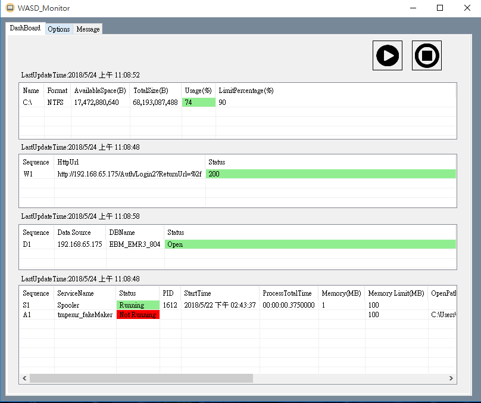
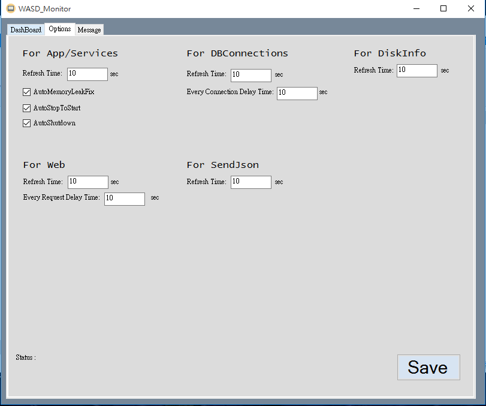
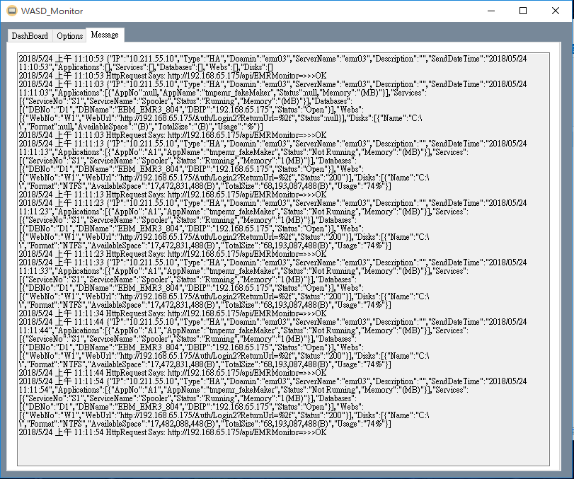

# 服務監控小助手(WASD Monitor)
*本程式主要用於Windows環境，其用於定時監控、控制及上傳監控資訊。於啟動後將自動撈取相關資訊。

## 監控範圍(WASD)
* Web
* Application
* Service
* DataBase
* Disk

## WD監控項目
* Website 連線狀態(Http)
* DataBase 連線狀態(Only MSSQL)
* Disk 容量上限警示

## AS監控項目
* Application、Service 記憶體監控
* Application、Service 記憶體超量重啟
* Application、Service 定時天數重啟

## Package
.Net Framework 4.5

## 其他功能
* 警示推播 (需界接其他 services)
* JSON Message上傳

## 監控路徑設定檔
* MonitorList (WASD_Monitor\ServiceControlUi\ServiceControlUi\bin\Debug\MonitorList.xml)
* 需與執行檔同一個資料夾目錄

## 使用者介面

